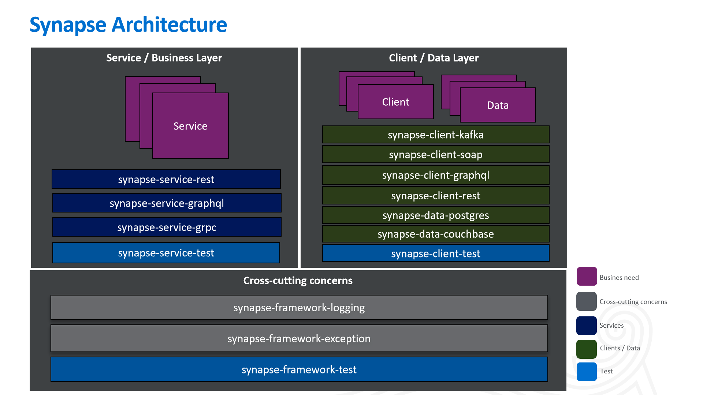

# Synapse

- Tired of spending time and struggling in designing your foundational architecture and starting out your project?
- Tired of having the developers in your team not following the consistent standards and each of them doing things their own
  way?
- Tired of having disorganized code that is difficult to maintain after just a few months of starting your project?
- Tired of spending countless hours, days, or months in getting your foundational frameworks robust and reliable?
- Are you looking to speed up development time while at the same time ensuring your development team is building application code in a robust manner,
- following good design principles and patterns? 
If any of these sound like situations you have experienced or situations you simply want to avoid, then Synapse is what
you need.

Synapse is a set of lightweight modules designed to speed up development time and help developers build out their
applications. The modules are focused towards server side implementation. Synapse serves as a wide range tool-suite
for developers to facilitate rapid development, with high quality built-in. It is designed with the purpose of helping
developers create web services in a quick and easy way following strict conventions. Synapse provides an abstraction
layer that enforces developers to follow SOLID principles and avoid common mistakes during the development process. It
is based on keeping things _simple_ and _clear_. The framework strongly encourages convention over configuration, while
highlighting the criticality of structure. Although Synapse will cover a majority of the scenarios you will need when
creating an enterprise-grade application, it is also very open to extension. We encourage you to extend and implement
the abstraction layer of this framework. Furthermore, if you feel the need to create a new feature not covered here, you
also have that flexibility.

## 📖 Table of Contents

- [Quick Start](#-quick-start)
- [Documentation](#-documentation)
- [License](#%EF%B8%8F-license)
- [Code Of Conduct](#%EF%B8%8F-code-of-conduct)
- [Community](#community)
- [Contributing](#-contributing)

## Synapse Architecture



Synapse focuses on the Application Tier of the well-established n-tier architecture pattern. 
Within the Application Tier, Synapse is geared towards breaking down the Business and Persistence layer. 
In the Business layer, we primarily have The modules are organized into types - the services, subscribers describe the modules that initiate a workflow. 
While the data and client modules represent modules that need to access or modify resources. 
The Synapse team recommends to modularize your application in a similar structure to maintain organization and clarity in your code. 
for application teams to utilize the same structure 

## Types of Modules:
### Business Layer 
This layer is intended to tackle specific business needs, typically business logic or rules or some level of delegation 
that is required by the Presentation Tier. This layer handles the delegation of work needed by the unit of work and stitches
the resource needs across the client and data modules.

  - **Service** - Used for any service communication method over HTTP (such as Rest, GraphQL, gRPC, etc.) that is  
starting a workflow. These services could be synchronous or asynchronous. The communication methods will typically support imperative and reactive support. 

  - **Business** - Used for placing common business logic across service modules. 
Essentially serves as an extension for the service module for commonalities across multiple service or subscriber modules.

  - **Subscriber** - Use during publisher, subscriber model. This module would initiate a flow listening to a topic or channel, typically implemented in Kafka, Solace, etc. 

### Data Access Layer
This layer is intended to be made modular and fine-grained to promote re-usability across service or subscriber modules. 

   - **Client** - Client modules are built to consume services. These modules are intended for performing any CRUD 

   - **Data** - Data modules are performing CRUD operations against a resource. 

   - **Publisher** - Publisher modules are used to share messages onto an asynchronous process 
e
### Cross-cutting Concerns / Tools 
   - **Framework** - These type of modules are needs that are required across most enterprise applications. 

   - **Utility** - These type of modules are generic utilities that could be reused throughout the application user's code base. 
Ideally, these should be small, lightweight modules built  for the specific utility need. 


## Recommended Application Module/Project Structure By Layer
```
application-name
    |
    +- service
    |   +- service-customer
    |   +- service-notification
    |   +- service-relationship
    |
    +- subscriber
    |   +- subscriber-customer
    |   +- subscriber-notification
    |
    +- client
    |    +- client-customer
    |    +- client-customer
    |
    +- data
    |    +- data-customer
    |    +- data-notification
    |
```
As you can see the modules begin with the word that describes that type of module. 
This helps ensure the modules are named  intuitive and organized within your IDE. 


## Synapse Modules:

### synapse-service-rest

- This module provides an abstraction framework used to help expose RESTful APIs. It provides several out-of-the-box
  functionalities like:

    - An open to extension generic set of abstract controller classes to easily build any concrete CRUD
      Controller by simply extending the needed base CRUD Controller class.
    - An open to extension configuration file that support for most of the available media types for RESTful
      webservices. If needed, new ones could be added. Also provides a default ObjectMapper for its serialization and
      deserialization. This can be overridden.
    - An open to extension generic ControllerExceptionHandler that handles the most common types of errors happening in
      an application.
    - An open to extension way of handling input validations.
    - An open to extension generic MetricInterceptor that will log the response time, status code and correlation
      identifier for every request.
    - Open to extensions base request and response model to leave the code open to extension and close to modifications.
    - A generic already implemented pagination solution out of the box when calling a db.
    - A common error response object following standard naming of error fields.
    - Spring Webflux is used for reactive support leveraging Netty, while Spring Web is also supported in Synapse
    
### synapse-client-rest

- This is the synapse gateway framework utilized to consume RESTful APIs. It provides several out-of-the-box
  functionalities like:

    - An open to extension BaseRestClient with several overloaded methods for every single possible restful call.
    - A configurable ClientLoggingInterceptor that logs the request and response parameters at a configurable log level.
    - An open to extension BaseRestResponseErrorHandler that handles the errors generated when calling the external
      restful APIs. This error handler has several default functionalities but is also open to extension. The
      functionalities are:
        - Log at error level the body and status code of the error returned. - Throw a HttpClientErrorException when an
          error of the 4XX family occurs - Throw a HttpServerErrorException when an error of the 5XX family occurs.
    - An open to extension generic hmac generator class.

### synapse-client-soap

- This is the synapse gateway framework utilized to consume SOAP web services. It provides several out-of-the-box
  functionalities like:

    - An open to extension BaseSoapClient with several overloaded methods for every single possible soap call.

### synapse-data-couchbase

- This is the synapse couchbase abstraction framework used whenever there is a need to connect to couchbase database and
  read from it. It provides several out-of-the-box functionalities like:

    - Built-in read functionalities to create multi-parameter and paginated dynamic queries based on Spring Data and
      QueryDSL.(There is not other library like this out-there, it still needs some work).
    - An open to extension base configuration java file with the standard connection parameters needed to connect to
      couchbase using Spring Data. The connection parameters will be provided by the property files on the module(s)that
      you as a developer are creating that will use this base-data-postgres module as a dependency.
    - An open to extension BaseEntity containing the generated key identifier and the common auditing fields maintained
      by the Spring Data framework itself (createdBy, lastModifiedBy, createdDate, lastModifiedDate and version).

### synapse-data-postgres

- This is the synapse data relational database abstraction framework used whenever there is a need to connect to
  postgres database. It provides several out-of-the-box functionalities like:

    - An open to extension base configuration java file open to extension that provides the connection logic to connect
      to any relational database and create a hikari connection pool. The connection parameters will be provided by
      property files on the modules using this module.
    - Open to extension property files with the default following values:
        - An open to extension connection pool default parameters. - An open to extension H2 connection parameters for
          local property file. - An open to extens4ion H2 initialization parameters for local property file. - An open
          to extension any relational database initialization parameters for three extra environments(E1, E2 and E3).

    - An open to extension BaseEntity that contains the key identifier with a default(open to extension also)
      GenerationType.IDENTITY and the common auditing fields maintained by the Spring Data framework itself (createdBy,
      lastModifiedBy, createdDate, lastModifiedDate and version).

### synapse-framework-exception

- This is the synapse module that provides the two Exception classes you will ever need in your application and also an
  elegant mechanism to handle them. It provides several out-of-the-box functionalities like:

    - An ApplicationServerException to wrap the caught checked exceptions thrown by the application.
    - An ApplicationClientException to return a user-friendly message to the users when a warning or message needs to be
      returned.
    - A generic open to extension ErrorCode enum with the most common error codes used by any application.
    - A generic open to extension error-messages.properties file that uses the error codes from the ErrorCode enum
      mentioned above.

### synapse-service-test

- This is the synapse module that provides the base classes to test the controllers. It provides several out-of-the-box
  functionalities like:

    - An open to extension BaseControllerTest class with several overloaded methods create the slice test methods of any
      possible restful call made to your controllers.
    - An open to extension BaseControllerIT class with several overloaded methods to create the integration test methods
      of any possible restful call made to your controllers.

### synapse-client-test

- This is the synapse module that provides the base classes to test the spring restful clients. It provides several
  out-of-the-box functionalities like:

    - An open to extension BaseRestClientUnitTest class which already calls several methods to unit test all the
      scenarios in the concrete client unit test class that extend this.
    - An open to extension BaseRestClientUnitIT class that will require only the concrete rest client IT class
      implementing it to override one success method which will be the integration test method needed.

### synapse-framework-api-docs

- This is the synapse module used for api documentation. This module is essentially a wrapper around swagger-ui, where
  it is already hooked on Synapse Rest framework, to provide Swagger UI out of the box for any rest api's built
  utilizing Synapse.

### synapse-utilities-common

- Encapsulates the common utility classes that can be leveraged by any module. It provides several out-of-the-box
  functionalities like:

    - A default object mapper defined in its configuration file

-----

## Benefits on-top Spring

- The Synapse framework is an extension of Spring that uses best practices to force compliance to good standards, while
  also simplifying the development process. These are several of the benefits it provides on-top of what Spring already
  provides:
    - Creates a very structured and organized architecture very easy to follow by anyone, junior and senior developers.
    - Enforces developers to follow the same template and good standards across the entire code base.
    - Forces strict separation of concerns because the base 'Hook' classes which the developers extend from are already
      representing each layer in the famous and already proven three layer architecture. - Base<Crud functionality>
      Controller (Http Layer). - Base<Crud functionality>Service (Service Layer). - BaseRestClient, BaseSoapClient or
      Repositories(These are already interfaces so not base classes provided) (DAO Layer).
    - Provides the BaseControllerTest class with a set of overloaded methods to facilitate controllers slice testing.
    - Provides a couchbase library to build dynamic queries based on Spring Data and Query DSL (There is nothing like
      this out there).
    - Provides a ControllersExceptionHandlers that handles most of the common exceptions.
    - Provides an elegant and very simple to use exception handling mechanism with only two custom runtime exceptions
      that covers all the possible scenarios.
    - Provides a generic way to connect to any relational database, using h2 for local and unit tests. And leave free
      the use of any desired relational database for other environments.

## Credits and Acknowledgements:

**Authors**

- Gabriel Jimenez
- Alexei Morgado
- Paolo Claudio
- Darien Liburd
- Shahzada Azam
- Krishna Kuchikulla

## 🚀‍ Quick Start

### Building an Enterprise Ready RESTful Web Service utilizing Synapse

### What you will build

This guide walks you through the process of creating a “Hello, World” RESTful web service with Synapse.

It will respond with a JSON representation of a greeting, as the following listing shows:

```json
{
  "message": "Hello, World!"
}
```

You can customize the greeting with an optional name parameter in the query string, as the following listing shows:

```http://localhost:8080/greeting?name=User```

The name parameter value overrides the default value of World and is reflected in the response, as the following listing
shows:

```json
{
  "message": "Hello, User!"
}
```

### What You Need

- About 15 minutes
- A favorite text editor or IDE
- JDK 1.8+
- Gradle 4+ or Maven 3.2+

You can also import the code straight into your IDE:

- IntelliJ IDEA
- Spring Tool Suite (STS)

The following listing shows the pom.xml file that is created when you choose Maven:

```xml
<?xml version="1.0" encoding="UTF-8"?>
<project xmlns="http://maven.apache.org/POM/4.0.0"
         xmlns:xsi="http://www.w3.org/2001/XMLSchema-instance"
         xsi:schemaLocation="http://maven.apache.org/POM/4.0.0 http://maven.apache.org/xsd/maven-4.0.0.xsd">
    <parent>
        <groupId>com.sample.bookstore</groupId>
        <artifactId>service</artifactId>
        <version>1.0.0-SNAPSHOT</version>
    </parent>

    <modelVersion>4.0.0</modelVersion>
    <groupId>com.sample.bookstore</groupId>
    <artifactId>service-greeting</artifactId>
    <version>1.0.0-SNAPSHOT</version>

    <properties>
        <start-class>com.sample.bookstore.GreetingApplication</start-class>
    </properties>

    <dependencies>
        <dependency>
            <groupId>io.americanexpress.synapse</groupId>
            <artifactId>synapse-service-rest</artifactId>
        </dependency>
    </dependencies>

    <build>
        <plugins>
            <plugin>
                <groupId>org.springframework.boot</groupId>
                <artifactId>spring-boot-maven-plugin</artifactId>
                <executions>
                    <execution>
                        <goals>
                            <goal>repackage</goal>
                        </goals>
                    </execution>
                </executions>
            </plugin>
            <plugin>
                <artifactId>maven-compiler-plugin</artifactId>
            </plugin>
            <plugin>
                <artifactId>maven-jar-plugin</artifactId>
            </plugin>
        </plugins>
    </build>

</project>

```

### Create a Resource Representation class

Now that you have set up the project and build system, you can create your web service.

Begin the process by thinking about service interactions.

The service will handle POST requests for /greetings, optionally with a name parameter in the query string. The POST
request should return a 200 OK response with JSON in the body that represents a greeting. It should resemble the
following output:

```json
   {
  "message": "Hello, User!"
}
```

The id field is a unique identifier for the greeting, and content is the textual representation of the greeting.

To model the greeting representation, create a resource representation class. To do so, provide a plain old Java object
with fields, constructors, and accessors for the id and content data, as the following listing (from
src/main/java/com/example/restservice/Greeting.java) shows:

Below is the request model.

```java
package com.sample.bookstore.model;

import BaseServiceRequest;

import java.util.Objects;

public class GreetingRequest extends BaseServiceRequest {

    private String name;

    public GreetingRequest(String name) {
        this.name = name;
    }

    public String getName() {
        return name;
    }

    public void setName(String name) {
        this.name = name;
    }

    @Override
    public boolean equals(Object o) {
        if (this == o) return true;
        if (o == null || getClass() != o.getClass()) return false;

        GreetingRequest that = (GreetingRequest) o;

        return Objects.equals(name, that.name);
    }

    @Override
    public int hashCode() {
        return name != null ? name.hashCode() : 0;
    }
}

```

Below is the response model.

```java
package com.sample.bookstore.model;

import BaseServiceResponse;

import java.util.Objects;

public class GreetingResponse extends BaseServiceResponse {

    private String message;

    public GreetingResponse(String message) {
        this.message = message;
    }

    public String getMessage() {
        return message;
    }

    public void setMessage(String message) {
        this.message = message;
    }


    @Override
    public String toString() {
        return "GreetingResponse{" +
                "message='" + message + '\'' +
                '}';
    }

    @Override
    public boolean equals(Object o) {
        if (this == o) return true;
        if (o == null || getClass() != o.getClass()) return false;

        GreetingResponse that = (GreetingResponse) o;

        return Objects.equals(message, that.message);
    }

    @Override
    public int hashCode() {
        return message != null ? message.hashCode() : 0;
    }
}
```

```java
package com.sample.bookstore;

import org.springframework.boot.SpringApplication;
import org.springframework.boot.autoconfigure.SpringBootApplication;

/**
 * <code>GreetingApplication</code> class that runs this service.
 *
 * @author Gabriel Jimenez
 */
@SpringBootApplication
public class GreetingApplication {

    /**
     * Run the application as a SpringBoot application.
     *
     * @param args program arguments
     */
    public static void main(String[] args) {
        SpringApplication.run(GreetingApplication.class, args);
    }

}

```

### Create a Resource Controller

In Spring’s approach to building RESTful web services, HTTP requests are handled by a controller. These components are
identified by the @RestController annotation, and the GreetingController shown in the following listing (from
src/main/java/com/example/restservice/GreetingController.java)
handles GET requests for /greeting by returning a new instance of the Greeting class:

```java
package com.sample.bookstore.controller;

import BaseController;
import com.sample.bookstore.model.GreetingRequest;
import com.sample.bookstore.model.GreetingResponse;
import com.sample.bookstore.service.GreetingService;
import io.swagger.annotations.Api;
import org.springframework.web.bind.annotation.RequestMapping;
import org.springframework.web.bind.annotation.RestController;


/**
 * <code>GreetingController</code> class is the controller that handles the greeting requests.
 * on the endpoint /greetings
 *
 * @author Gabriel Jimenez
 */
@RestController
@RequestMapping("/greetings")
@Api(value = "Greeting API", tags = "Greeting")
public class GreetingController extends BaseController<GreetingRequest, GreetingResponse, GreetingService> {
}
```

### Create a API Config

```java
package com.sample.bookstore.config;

import com.americanexpress.synapse.service.rest.config.BaseServiceRestConfig;
import org.springframework.context.annotation.ComponentScan;
import org.springframework.context.annotation.Configuration;
import org.springframework.context.annotation.Import;
import org.springframework.context.annotation.PropertySource;
import org.springframework.web.servlet.config.annotation.WebMvcConfigurer;

/**
 * <code>GreetingConfig</code> class sets configurations used in this module.
 *
 * @author Gabriel Jimenez
 */
@Configuration
@PropertySource("classpath:/service-greeting-application.properties")
@Import({BaseServiceRestConfig.class})
@ComponentScan(basePackages = "com.example.synapse.bookstore")
public class GreetingConfig implements WebMvcConfigurer {
}
```

### Create a Resource Service

```java
package com.sample.bookstore.service;

import ServiceHeaders;
import BaseService;
import com.sample.bookstore.model.GreetingRequest;
import com.sample.bookstore.model.GreetingResponse;
import org.springframework.stereotype.Service;

import static java.util.Objects.nonNull;

/**
 * The <code>GreetingService</code> class is responsible handling the business logic of the Greeting API. 
 */
@Service
public class GreetingService extends BaseService<GreetingRequest, GreetingResponse> {

    private static final String template = "Hello, %s!";

    @Override
    protected GreetingResponse getResource(ServiceHeaders headers, GreetingRequest request) {
        if (nonNull(request.getName())) {
            return new GreetingResponse(String.format(template, request.getName()));
        } else {
            return new GreetingResponse(String.format(template, "World!"));
        }
    }
}
```

Now make sure to set your environment to `local`:

### Summary

Congratulations! You built a simple web application utilizing Synapse and learned how it can ramp up your development
pace. You also turned on some handy production services. This is only a small sampling of what Synapse can do.

## 📜 Documentation

https://americanexpress.io/synapse/

## 🏆 Contributing

We welcome Your interest in the American Express Open Source Community on Github. Any Contributor to any Open Source
Project managed by the American Express Open Source Community must accept and sign an Agreement indicating agreement to
the terms below. Except for the rights granted in this Agreement to American Express and to recipients of software
distributed by American Express, You reserve all right, title, and interest, if any, in and to Your Contributions.
Please
[fill out the Agreement](https://cla-assistant.io/americanexpress/synapse).

## 🗝️ License

Any contributions made under this project will be governed by the
[Apache License 2.0](./LICENSE).

## 🗣️ Code of Conduct

This project adheres to the [American Express Community Guidelines](./CODE_OF_CONDUCT.md). By participating, you are
expected to honor these guidelines.
