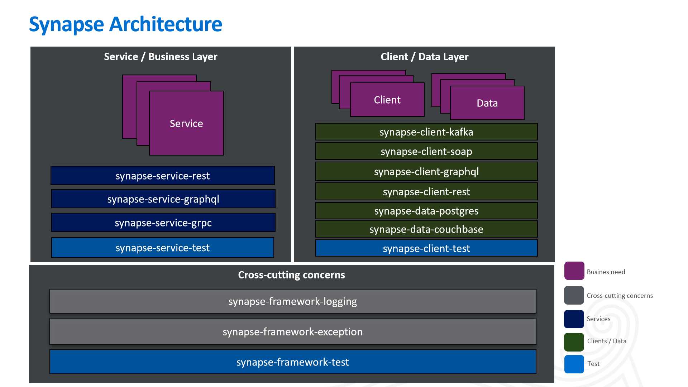

# Synapse


Repository: https://github.com/americanexpress/synapse


- Tired of spending time and struggling in designing your foundational architecture and starting out your project?
- Tired of having the developers in your team not following the same standards and each of them doing things their own
  way?
- Tired of having a disorganized code base difficult to maintain after just a few months of starting your project?
- Tired of spending countless hours, days, or months in getting your foundational frameworks robust and reliable?

If any of these sound like situations you have experienced or situations you simply want to avoid, then Synapse is what
you need.

Synapse is a set of lightweight modules designed to speed up development time and help developers build out their
applications. The modules are focused towards server side implementation. The modules serve as a wide range tool-suite
for developers to facilitate rapid development, with high quality built-in. It is designed with the purpose of helping
developers create web services in a quick and easy way following strict conventions. Synapse provides an abstraction
layer that enforces developers to follow SOLID principles and avoid common mistakes during the development process. It
is based on keeping things _simple_ and _clear_. The framework strongly encourages convention over configuration, while
highlighting the criticality of structure. Although Synapse will cover a majority of the scenarios you will need when
creating an enterprise-grade application, it is also very open to extension. We encourage you to extend and implement
the abstraction layer of this framework. Furthermore, if you feel the need to create a new feature not covered here, you
also have that flexibility.

## 📖 Table of Contents

- [Quick Start](#-quick-start)
- [Documentation](#-documentation)
- [License](#%EF%B8%8F-license)
- [Code Of Conduct](#%EF%B8%8F-code-of-conduct)
- [Community](#community)
- [Contributing](#-contributing)

## Synapse Architecture



## Benefits on-top Spring

- The Synapse framework is an extension of Spring that uses best practices to force compliance to good standards, while
  also simplifying the development process. These are several of the benefits it provides on-top of what Spring already
  provides:
    - Creates a very structured and organized architecture very easy to follow by anyone, junior and senior developers.
    - Enforces developers to follow the same template and good standards across the entire code base.
    - Forces strict separation of concerns because the base 'Hook' classes which the developers extend from are already
      representing each layer in the famous and already proven three layer architecture. - Base
      Controller (Http Layer). - BaseService (Service Layer). - BaseRestClient, BaseSoapClient or
      Repositories(These are already interfaces so not base classes provided) (DAO Layer).
    - Provides the BaseControllerTest class with a set of overloaded methods to facilitate controllers slice testing.
    - Provides a couchbase library to build dynamic queries based on Spring Data and Query DSL (There is nothing like
      this out there).
    - Provides a ControllersExceptionHandlers that handles most of the common exceptions.
    - Provides an elegant and very simple to use exception handling mechanism with only two custom runtime exceptions
      that covers all the possible scenarios.
    - Provides a generic way to connect to any relational database, using h2 for local and unit tests. And leave free
      the use of any desired relational database for other environments.

## Credits and Acknowledgements:

**Authors**

- Gabriel Jimenez
- Alexei Morgado
- Paolo Claudio
- Darien Liburd
- Shahzada Azam
- Krishna Kuchikulla

## 🚀‍ Quick Start

### Building an Enterprise Ready RESTful Web Service utilizing Synapse

### What you will build

This guide walks you through the process of creating a “Hello, World” RESTful web service with Synapse.

It will respond with a JSON representation of a greeting, as the following listing shows:

```json
   {
  "message": "Hello, World!"
}
```

You can customize the greeting with an optional name parameter in the query string, as the following listing shows:

```http://localhost:8080/greeting?name=User```

The name parameter value overrides the default value of World and is reflected in the response, as the following listing
shows:

```json
   {
  "message": "Hello, User!"
}
```

### What You Need

- About 15 minutes
- A favorite text editor or IDE
- JDK 1.8+
- Gradle 4+ or Maven 3.2+

You can also import the code straight into your IDE:

- IntelliJ IDEA
- Spring Tool Suite (STS)

The following listing shows the pom.xml file that is created when you choose Maven:

```xml
<?xml version="1.0" encoding="UTF-8"?>
<project xmlns="http://maven.apache.org/POM/4.0.0"
         xmlns:xsi="http://www.w3.org/2001/XMLSchema-instance"
         xsi:schemaLocation="http://maven.apache.org/POM/4.0.0 http://maven.apache.org/xsd/maven-4.0.0.xsd">
    <parent>
        <groupId>com.example</groupId>
        <artifactId>service</artifactId>
        <version>0.3.26-SNAPSHOT</version>
    </parent>

    <modelVersion>4.0.0</modelVersion>
    <groupId>com.example.synapse</groupId>
    <artifactId>service-greeting</artifactId>
    <version>0.3.26-SNAPSHOT</version>

    <properties>
        <start-class>com.example.synapse.bookstore.GreetingApplication</start-class>
    </properties>

    <dependencies>
        <dependency>
            <groupId>com.americanexpress</groupId>
            <artifactId>synapse-service-rest</artifactId>
            <version>0.3.26-SNAPSHOT</version>
        </dependency>
    </dependencies>

    <build>
        <plugins>
            <plugin>
                <groupId>org.springframework.boot</groupId>
                <artifactId>spring-boot-maven-plugin</artifactId>
                <executions>
                    <execution>
                        <goals>
                            <goal>repackage</goal>
                        </goals>
                    </execution>
                </executions>
            </plugin>
            <plugin>
                <artifactId>maven-compiler-plugin</artifactId>
            </plugin>
            <plugin>
                <artifactId>maven-jar-plugin</artifactId>
            </plugin>
        </plugins>
    </build>

</project>

```

### Create a Resource Representation class

Now that you have set up the project and build system, you can create your web service.

Begin the process by thinking about service interactions.

The service will handle POST requests for /greetings, optionally with a name parameter in the query string. The POST
request should return a 200 OK response with JSON in the body that represents a greeting. It should resemble the
following output:

```json
   {
  "message": "Hello, User!"
}
```

The id field is a unique identifier for the greeting, and content is the textual representation of the greeting.

To model the greeting representation, create a resource representation class. To do so, provide a plain old Java object
with fields, constructors, and accessors for the id and content data, as the following listing (from
src/main/java/com/example/restservice/Greeting.java) shows:

Below is the request model.

```java
package com.example.synapse.bookstore.model;

import BaseServiceRequest;

import java.util.Objects;

public class GreetingRequest extends BaseServiceRequest {

    private String name;

    public GreetingRequest(String name) {
        this.name = name;
    }

    public String getName() {
        return name;
    }

    public void setName(String name) {
        this.name = name;
    }

    @Override
    public boolean equals(Object o) {
        if (this == o) return true;
        if (o == null || getClass() != o.getClass()) return false;

        GreetingRequest that = (GreetingRequest) o;

        return Objects.equals(name, that.name);
    }

    @Override
    public int hashCode() {
        return name != null ? name.hashCode() : 0;
    }
}

```

Below is the response model.

```java
package com.example.synapse.bookstore.model;

import BaseServiceResponse;

import java.util.Objects;

public class GreetingResponse extends BaseServiceResponse {

    private String message;

    public GreetingResponse(String message) {
        this.message = message;
    }

    public String getMessage() {
        return message;
    }

    public void setMessage(String message) {
        this.message = message;
    }


    @Override
    public String toString() {
        return "GreetingResponse{" +
                "message='" + message + '\'' +
                '}';
    }

    @Override
    public boolean equals(Object o) {
        if (this == o) return true;
        if (o == null || getClass() != o.getClass()) return false;

        GreetingResponse that = (GreetingResponse) o;

        return Objects.equals(message, that.message);
    }

    @Override
    public int hashCode() {
        return message != null ? message.hashCode() : 0;
    }
}
```

```java
package com.example.synapse.bookstore;

import org.springframework.boot.SpringApplication;
import org.springframework.boot.autoconfigure.SpringBootApplication;

/**
 * <code>GreetingApplication</code> class that runs this service.
 *
 * @author Gabriel Jimenez
 */
@SpringBootApplication
public class GreetingApplication {

    /**
     * Run the application as a SpringBoot application.
     *
     * @param args program arguments
     */
    public static void main(String[] args) {
        SpringApplication.run(GreetingApplication.class, args);
    }

}

```

### Create a Resource Controller

In Spring’s approach to building RESTful web services, HTTP requests are handled by a controller. These components are
identified by the @RestController annotation, and the GreetingController shown in the following listing (from
src/main/java/com/example/restservice/GreetingController.java)
handles GET requests for /greeting by returning a new instance of the Greeting class:

```java
package com.example.synapse.bookstore.controller;

import BaseController;
import com.example.synapse.bookstore.model.GreetingRequest;
import com.example.synapse.bookstore.model.GreetingResponse;
import com.example.synapse.bookstore.service.GreetingService;
import io.swagger.annotations.Api;
import org.springframework.web.bind.annotation.RequestMapping;
import org.springframework.web.bind.annotation.RestController;


/**
 * <code>GreetingController</code> class is the controller that handles the greeting requests.
 * on the endpoint /greetings
 *
 * @author Gabriel Jimenez
 */
@RestController
@RequestMapping("/greetings")
@Api(value = "Greeting API", tags = "Greeting")
public class GreetingController extends BaseController<GreetingRequest, GreetingResponse, GreetingService> {
}
```

### Create a API Config

```java
package com.example.synapse.bookstore.config;

import com.americanexpress.synapse.service.rest.config.BaseServiceRestConfig;
import org.springframework.context.annotation.ComponentScan;
import org.springframework.context.annotation.Configuration;
import org.springframework.context.annotation.Import;
import org.springframework.context.annotation.PropertySource;
import org.springframework.web.servlet.config.annotation.WebMvcConfigurer;

/**
 * <code>GreetingConfig</code> class sets configurations used in this module.
 *
 * @author Gabriel Jimenez
 */
@Configuration
@PropertySource("classpath:/service-greeting-application.properties")
@Import({BaseServiceRestConfig.class})
@ComponentScan(basePackages = "com.example.synapse.bookstore")
public class GreetingConfig implements WebMvcConfigurer {
}
```

### Create a Resource Service

```java
package com.example.synapse.bookstore.service;

import ServiceHeaders;
import BaseService;
import com.example.synapse.bookstore.model.GreetingRequest;
import com.example.synapse.bookstore.model.GreetingResponse;
import org.springframework.stereotype.Service;

import static java.util.Objects.nonNull;

/**
 * The <code>GreetingService</code> class is responsible handling the business logic of the Greeting API. 
 */
@Service
public class GreetingService extends BaseService<GreetingRequest, GreetingResponse> {

    private static final String template = "Hello, %s!";

    @Override
    protected GreetingResponse getResource(ServiceHeaders headers, GreetingRequest request) {
        if (nonNull(request.getName())) {
            return new GreetingResponse(String.format(template, request.getName()));
        } else {
            return new GreetingResponse(String.format(template, "World!"));
        }
    }
}
```

Now make sure to set your environment to `local`:

### Summary

Congratulations! You built a simple web application utilizing Synapse and learned how it can ramp up your development
pace. You also turned on some handy production services. This is only a small sampling of what Synapse can do.

## 📜 Documentation

https://americanexpress.io/synapse/

## 🏆 Contributing

We welcome Your interest in the American Express Open Source Community on Github. Any Contributor to any Open Source
Project managed by the American Express Open Source Community must accept and sign an Agreement indicating agreement to
the terms below. Except for the rights granted in this Agreement to American Express and to recipients of software
distributed by American Express, You reserve all right, title, and interest, if any, in and to Your Contributions.
Please
[fill out the Agreement](https://cla-assistant.io/americanexpress/synapse).

## 🗝️ License

Any contributions made under this project will be governed by the
[Apache License 2.0](./LICENSE).

## 🗣️ Code of Conduct

This project adheres to the [American Express Community Guidelines](./CODE_OF_CONDUCT.md). By participating, you are
expected to honor these guidelines.
 
