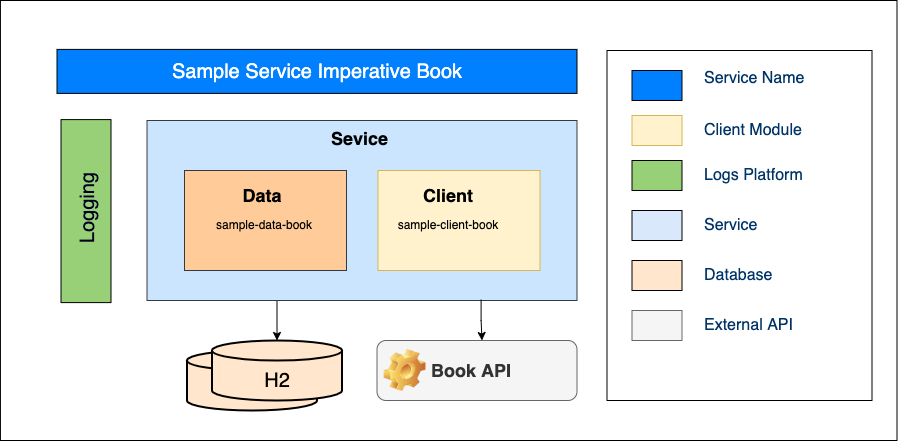
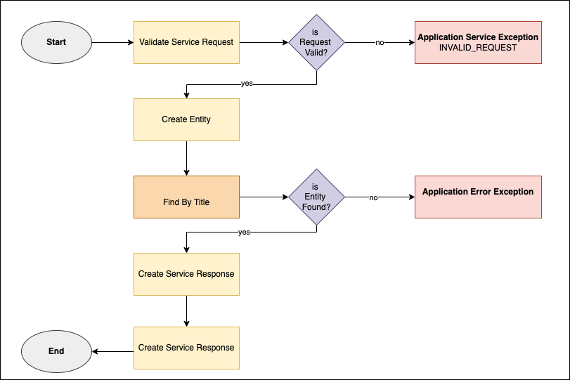
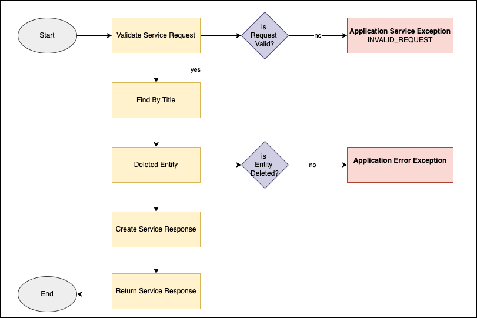

# Sample Service Imperative Book

## Description

## Code Contributors
- Francois Gutt

## Specifications

## Tech Stack
* Java 17
* Spring Boot
* Maven

## Dependencies
- JDK 17

## Architecture Diagram
### Book

## Flow Diagram

### create book

### Read book

### Update book

### Delete book

## Testing Components
* JUnit
* Postman Collection

## Deployment
Deployed using GitHub Actions.

## Run it Locally
### Setting up Vault on your Local

loper will review the request and grant access so your service will be authorized to send requests to Identity Profile.